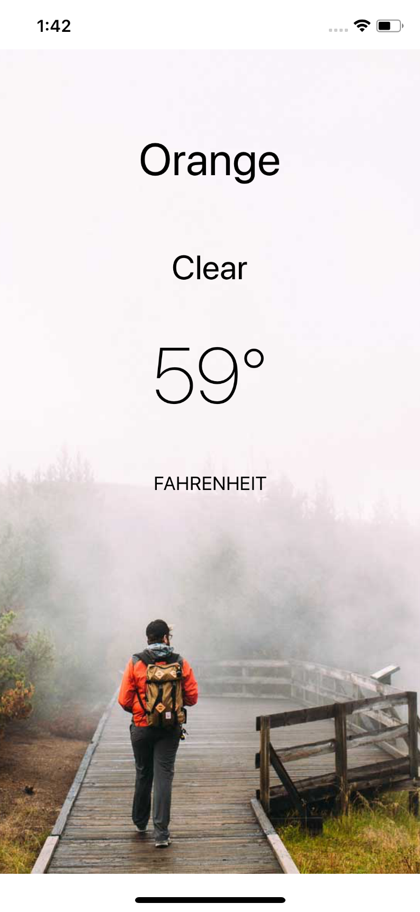

# WeatherTracker

#### Developed by : Medi Assumani
#### Instructor : Duc Tran 
#### Technology : Swift 4.0 and Xcode 9.3
#### Purpose : 
This is a simple app i am building by learning about Networking, REST APIs, JSON, JSON Parsing in ios. Thanks to Duc Tran for the tutorail. His version of the app uses JSONSerialization to parse json responce, The challenge for me will be to transition it to Swift's Decodable to improve readability and simplicity as well as using CoreLocation to get an accurate weather report. 

